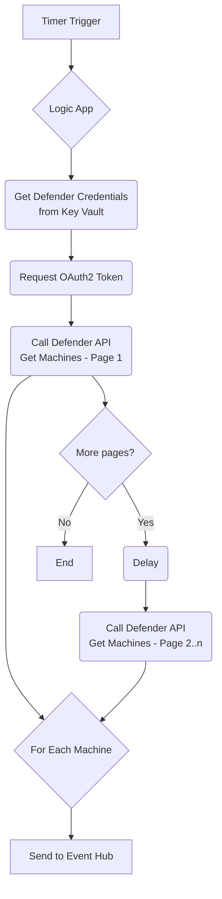

# Zscaler & Microsoft Defender Integration Connector

This folder contains the resources to deploy an integration component that connects Microsoft Defender for Endpoint with the Zscaler platform.

## Overview

The solution uses an Azure Logic App to periodically retrieve device security posture data from the Microsoft Defender API. This data is then published as messages to an Azure Event Hub. A Zscaler service can then consume events from this Event Hub to enforce adaptive access control policies based on up-to-date device information from Defender.

This entire infrastructure is deployed using an Azure Bicep template.

## Architecture

The workflow is as follows:

1.  A timer-triggered Azure Logic App runs at a configurable interval (defaulting to every 15 minutes).
2.  The Logic App authenticates to Azure Key Vault using its Managed Identity to retrieve the Defender API credentials.
3.  It requests an OAuth2 access token from the Microsoft Identity Platform.
4.  It makes an authenticated call to the Microsoft Defender `/api/machines` endpoint to fetch device data. The Logic App handles API pagination to ensure all machine records are retrieved.
5.  The collected data is then sent as an event to a secured Azure Event Hub.



## Prerequisites

Before deploying the Bicep template, you will need the following information:

*   **Defender Tenant ID**: The Azure Active Directory Tenant ID where Microsoft Defender is running.
*   **Defender Client ID**: The Application (Client) ID for an App Registration with permissions to read Defender's machine data.
*   **Defender Client Secret**: The Client Secret for the App Registration.

The App Registration needs to have the `Machine.Read.All` API permission for **Microsoft Threat Protection**.

## Deployment

The resources are defined in the `zscaler-azure-logic-app/zscaler-azure-logic-app.bicep` file and can be deployed using the Azure CLI or PowerShell.

### Parameters

The Bicep template requires the following parameters:

| Parameter                | Description                                                                                                                           |
| ------------------------ | ------------------------------------------------------------------------------------------------------------------------------------- |
| `baseName`               | A unique base name (e.g., `zaa-prod-001`) used as a prefix for all created resources.                                                   |
| `location`               | The Azure region where the resources will be deployed. Defaults to the resource group's location.                                     |
| `logicAppLocation`       | The Azure region for the Logic App. Should be a location where Logic App connectors are available.                                      |
| `logicAppTriggerInterval`| The interval (in units of `logicAppTriggerFrequency`) for the Logic App trigger. Defaults to `15`.                                    |
| `logicAppTriggerFrequency`| The frequency unit for the Logic App trigger. Allowed values are `Minute`, `Hour`, `Day`. Defaults to `Minute`.                       |
| `logicAppApiDelaySeconds`  | The delay in seconds between paginated API calls. Defaults to `5`.                                                                    |
| `defenderClientId`       | (Secure) The Client ID for the Defender App Registration.                                                                             |
| `defenderClientSecret`   | (Secure) The Client Secret for the Defender App Registration.                                                                         |
| `defenderTenantId`       | The Tenant ID for the Defender instance.                                                                                              |
| `allowedIpAddresses`     | An array of public IP addresses or CIDR ranges allowed to access the Event Hub. It defaults to a list of known Zscaler cloud IPs.       |
| `allowedVnetSubnetId`    | (Optional) The resource ID of a virtual network subnet to grant access to the Event Hub.                                              |

### Deployment Example (Azure CLI)

1.  **Create a resource group:**
    ```sh
    az group create --name MyResourceGroup --location "East US"
    ```

2.  **Deploy the Bicep template:**
    ```sh
    az deployment group create \
      --resource-group MyResourceGroup \
      --template-file ./zscaler-azure-logic-app/zscaler-azure-logic-app.bicep \
      --parameters baseName=<your-unique-base-name> \
      --parameters defenderTenantId=<your-defender-tenant-id> \
      --parameters defenderClientId=<your-defender-client-id> \
      --parameters defenderClientSecret=<your-defender-client-secret>
    ```

## Post-Deployment

After a successful deployment, the Event Hub will be ready to receive data. To consume events from the Event Hub, the consuming application (e.g., a Zscaler service) will need connection details.

The deployment creates a specific authorization rule named `zs-aae-listen-policy` on the Event Hub with "Listen" permissions. You can retrieve its connection string from the Azure Portal or using the Azure CLI:

```sh
az eventhubs eventhub authorization-rule keys list \
  --resource-group MyResourceGroup \
  --namespace-name <your-unique-base-name>-ns \
  --eventhub-name <your-unique-base-name>-evh \
  --name zs-aae-listen-policy \
  --query "primaryConnectionString"
```

## Created Azure Resources

The template will create the following resources:

*   **Azure Key Vault**: For secure storage of API credentials.
*   **Azure Event Hub Namespace**: The namespace for the event hub.
*   **Azure Event Hub**: The specific event hub to receive Defender data.
*   **Azure Logic App**: The workflow engine that orchestrates the data transfer.
*   **API Connections**: Managed connectors for Key Vault and Event Hub.
*   **Role Assignments**: Grants the Logic App's Managed Identity the necessary permissions to Key Vault and Event Hub.
